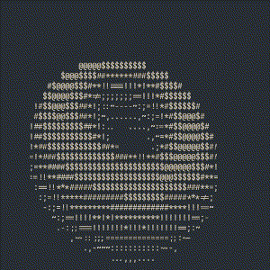

# Donut
I think donut.c is pretty cool. This recreation may not look exactly the same as the original, but it's good enough for me, and I learned quite a lot too. You can read more about it here: https://www.a1k0n.net/2011/07/20/donut-math.html  

